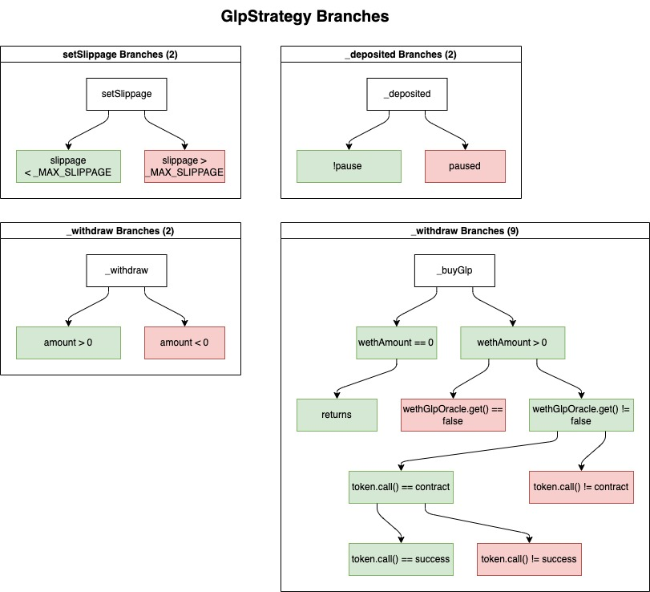

## Specifications tested in GlpStrategy

1. tsGLP passed in on deposit is staked for GlpStrategy 
2. GLP bought with weth rewards is staked for GlpStrategy 
3. Harvesting uses all the weth rewards balance if it's nonzero 
4. Only YieldBox can withdraw and deposit 
5. Depositing sGLP directly to strategy should fail 
6. Calling harvest with 0 rewards accumulated doesn't revert 
7. User balance of sGLP increases by amount on call to withdraw 
8. GlpStrategy balance of sGLP decreases on withdrawal 
9. User can always withdraw up to the full amount of GLP + weth rewards in the GlpStrategy 
10. User can only withdraw yield accumulated for their shares 

## Coverage

The tests implemented include unit tests and fuzz tests. The test structure used includes wrappers, fuzz and implementations. 
- wrappers evaluate a single value for a unit test implementation(suffixed with `_wrapper`)
- fuzz tests take a random input value to evaluate the implementation (prefixed with `testFuzz`)
- implementations hold the actual test logic and assertions (prefixed with `test_`, no suffix)

NOTE: some tests which would not benefit from fuzz testing only have an implementation and no fuzz or wrappers. 

The branches covered are shown in the following diagram, where red blocks indicate revert paths and green blocks indicate successful execution. 



## Findings 

1. Informational - Full reward amount can only be withdrawn with shares for first depositor

Description: The first depositor into GlpStrategy will have all shares allocated to them (`shares[depositor] == totalSupply`), but due to rounding in YieldBox, if they have accumulated rewards on their deposit and try to withdraw by passing in the balance of the strategy (which they are owed), the conversion of the amount they are withdrawing is > totalSupply of shares, they are therefore only able to withdraw their full amount by passing in the totalSupply of shares. 

POC:
Adding the following console logs to the ERC1155 contract's `_burn` function: 

```solidity
function _burn(address from, uint256 id, uint256 value) internal {
        require(from != address(0), "No 0 address");

        console2.log(
            "total supply of shares less than redeemed amount: ",
            totalSupply[id] < value
        );
        console2.log("total supply of shares: %e", totalSupply[id]);

        balanceOf[from][id] -= value;
        totalSupply[id] -= value;
```

demonstrates that when running the `test_rewards_always_withdrawable` test where a user tries to withdraw their entire initial deposit + yield earned, the following line from the test triggers a revert in the `_burn` function:

```solidity
uint256 totalSupplyOfShares = yieldBox.totalSupply(glpStratAssetId);
        yieldBox.withdraw(
            glpStratAssetId,
            binanceWalletAddr,
            binanceWalletAddr,
            0,
            totalSupplyOfShares
        );
```
because the rounding up of shares in `YieldBox::_withdrawFungible` which allocates more shares to the user than the totalSupply:

```solidity
function _withdrawFungible(
        Asset storage asset,
        uint256 assetId,
        address from,
        address to,
        uint256 amount,
        uint256 share
    ) internal returns (uint256 amountOut, uint256 shareOut) {
        // Effects
        uint256 totalAmount = _tokenBalanceOf(asset);
        if (share == 0) {
            // value of the share paid could be lower than the amount paid due to rounding, in that case, add a share (Always round up)
            share = amount._toShares(totalSupply[assetId], totalAmount, true);
		...
		}
	}
```

This same issue is demonstrated in `test_rewards_always_withdrawable_multiple` where if multiple users deposit and withdraw, if the last user attempts to withdraw the remaining balance of sGLP in the strategy (which should correspond to their amount of shares), it also triggers and underflow revert in the ERC1155 `_burn` function due to the following line: 

```solidity
 		// Bob tries to withdraw his amount which should be the remaining balance of the strategy
        vm.startPrank(bob);
        uint256 amountRemainingInStrategy = sGLP.balanceOf(
            address(glpStrategy)
        );

        yieldBox.withdraw(glpStratAssetId, bob, bob, amountRemainingInStrategy, 0);
        vm.stopPrank();
```


Recommendation: This issue can be mitigated by ensuring front-end logic prevents this edge case or only allowing sole depositors to withdraw by passing in shares. 

2. Informational - Unclear natspec

Description: The ITapiocaOracle natspec states that the `get` function:

```solidity
@return success if no valid (recent) rate is available, return false else true.
```

Impact: This would imply that calls to `get` in `_buyGlp` would revert if there IS a valid recent rate returned by the oracle, and only pass if there is NOT a valid recent rate due to the following lines: 

Lines affected: 
```solidity
(success, glpPrice) = wethGlpOracle.get(wethGlpOracleData);
    if (!success) revert Failed();
```

The natspec makes understanding the effect in the resulting implementation difficult to discern.

Recommendation: rephrase natspec for clearer definition of function or change return variable name to make definition clearer

3. Informational - user trying to overdraw their account shares could receive more descriptive message

Description: In test `test_user_cant_overdraw` it reverts due to underflow when user tries to withdraw more than their balance, throwing a more descriptive error could allow for better error handling.

4. Informational - users can withdraw when paused

Description: `_withdraw` function is missing a check for paused:

```solidity
 function _withdraw(address to, uint256 amount) internal override {
        if (amount == 0) revert NotValid();
        _claimRewards(); // Claim rewards before withdrawing
        _buyGlp(); // Buy GLP with WETH rewards

        sGLP.safeApprove(contractAddress, amount);
        ITOFT(contractAddress).wrap(address(this), to, amount); // wrap the sGLP to tsGLP to `to`, as a transfer
        sGLP.safeApprove(contractAddress, 0);
    }
```

the `sDaiStrategy` has a check that prevents withdrawals if the system is paused, which makes the two strategies inconsistent with each other: 

```solidity
/// @dev burns sDai in exchange of Dai and wraps it into tDai
    function _withdraw(
        address to,
        uint256 amount
    ) internal override nonReentrant {
        if (paused) revert Paused();
		...
	}
```


