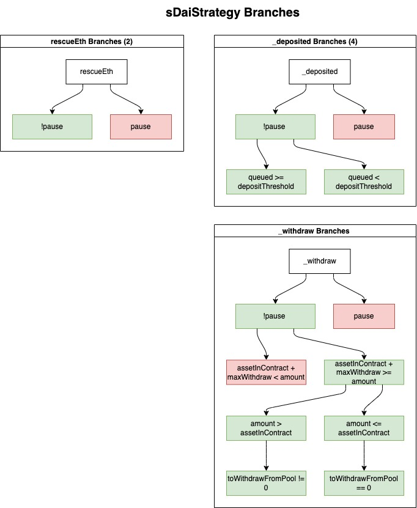

## Specifications tested in sDaiStrategy

1. tDAI passed in on deposit is deposited for sDaiStrategy 
2. user can always withdraw as much as they deposited 
3. only YieldBox can withdraw and deposit into strategy 
4. depositing sDAI directly to strategy should not result in user getting shares 
5. withdrawing with 0 savings accumulated doesn't revert 
6. user balance of tDAI increases by amount on call to withdraw 
7. sDaiStrategy balance of sDAI decreases on withdrawal 
8. User can always withdraw up to the full amount of sDAI in the GlpStrategy 
9. User can only withdraw share + yield accumulated for their shares 
10. User withdrawing their share doesn't affect other's ability to withdraw 
11. Tokens are added to deposit queue if threshold isn't met when depositing 
12. Deposit queue gets fully deposited, no dust remains 
13. User can withdraw if their assets remain in queue 

NOTE: any tests that make assertions with initialUserBalance - 1 are taking into account that user loses a dust amount when withdrawing. 

## Coverage 

The tests implemented include unit tests and fuzz tests. The test structure used includes wrappers, fuzz and implementations. 
- wrappers evaluate a single value for a unit test implementation(suffixed with `_wrapper`)
- fuzz tests take a random input value to evaluate the implementation (prefixed with `testFuzz`)
- implementations hold the actual test logic and assertions (prefixed with `test_`, no suffix)

NOTE: some tests which would not benefit from fuzz testing only have an implementation and no fuzz or wrappers. 

The branches covered are shown in the following diagram, where red blocks indicate revert paths and green blocks indicate successful execution. 




## Findings 

1. Low - `harvestable` missing return value

Description: `SDaiStrategy::harvestable` always returns a 0 value for the accumulated savings. When calling the same `sDai::maxWithdraw` function directly from the test contract this returns the correct value. Demonstrated in `test_harvestable_with_accumulation`.

This is because the `harvestable` function queries the `maxWithdraw` amount but doesn't return it:

```solidity
 function harvestable() external view returns (uint256 result) {
        // @audit need to return this value
        sDai.maxWithdraw(address(this));
    }
```

Impact: any UI or integrating contracts reliant on this function will display an incorrect amount for the accumulated savings

Recommendation: Return result from the `harvestable` function

2. Informational - comments for `emergencyWithdraw` incorrect

Description: comments for `emergencyWithdraw` state that it "withdraws everything from the strategy" but it actually withdraws everything from sDai to the strategy.